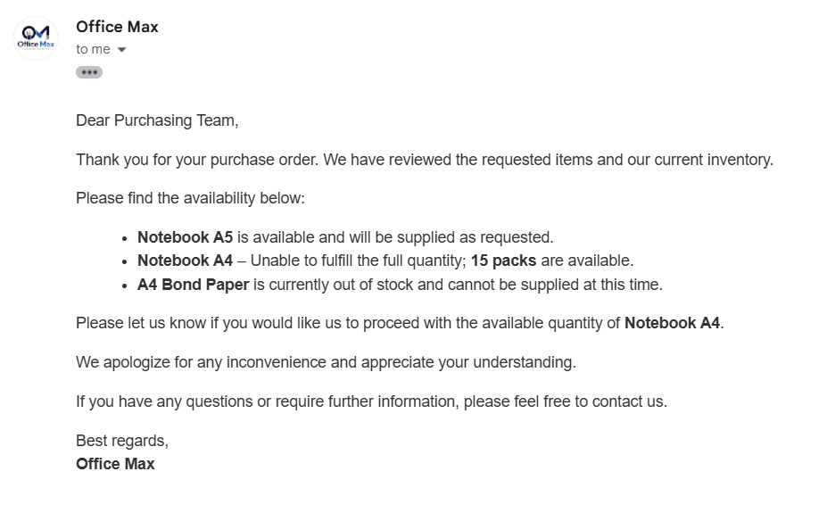
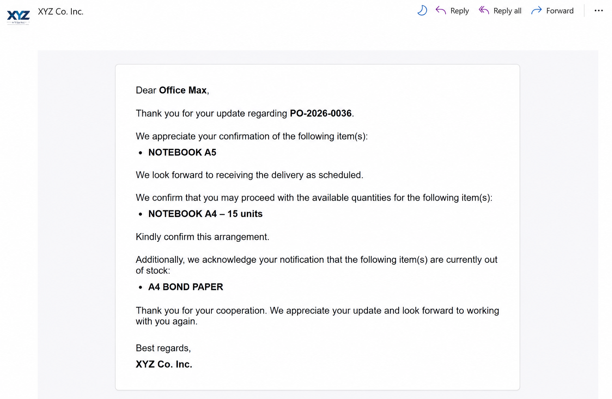
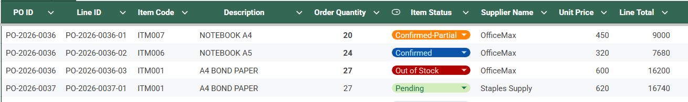
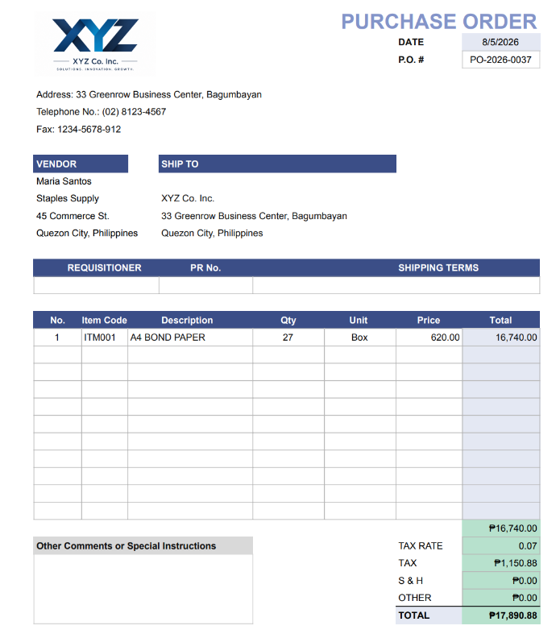

# Hi, I'm Aaron 👋

Certified Industrial Engineer specializing in AI-powered process automation. I build intelligent workflow systems (n8n, LLM agents) that eliminate manual work and improve operational efficiency — combining formal process improvement training with hands-on automation development.

💼 **LinkedIn:** [Connect with me](https://www.linkedin.com/in/estacioaaron/)
📧 **Email:** aaron.estacio@outlook.com

---

## 🚀 Projects

### 1. AI-Driven Supplier Response Automation System
**Tools:** n8n, AI Agent (OpenAI), Gmail, Slack, Google Sheets

🎥 [Watch demo video](https://drive.google.com/file/d/1bEC3Vn-LoiP-GInlcJ4aa9muzaaKUE9D/view)

An AI-powered email classification agent that interprets supplier responses, classifies fulfillment status (Confirmed, Partial, Out of Stock), and extracts structured purchase order data from unstructured emails.

- Designed intelligent workflows that evaluate each purchase order line item independently, handling mixed fulfillment scenarios within a single supplier response, and automatically routing approvals, database updates, supplier replies, and purchase order actions
- Engineered a reliable execution flow with multi-item processing, human-in-the-loop approvals, and error handling — reducing average manual processing time per supplier email by **~91%** (from ~17 min to ~1.5 min)
- Eliminated manual email reconciliation, improving overall procurement workflow efficiency

📄 [Full write-up](https://broadleaf-soapwort-c9a.notion.site/AI-Driven-Supplier-Response-Automation-System-3ac82207a57680aebfc8f314f597287b)
📄 [Download full workflow diagram (PDF)](AI-Driven_Supplier_Response_Automation_System/Workflow_Full_Image.pdf)

📸 View screenshots

 

**Supplier's actual email**
 

  

**Final email sent to supplier**
 

  

**Updated PO line items**
 

  

**Newly replaced PO**
 

---

### 2. AI-Powered Procurement and Inventory Management System
**Tools:** n8n, AI Agent (OpenAI), Google Sheets, Slack, Gmail, Google Drive

An AI-powered procurement automation system that monitors inventory, detects reorder requirements, and automatically generates purchase orders based on business rules.

- Automated the end-to-end procurement workflow, including approval routing, supplier communication, PDF generation, inventory updates, and purchase order tracking through integrated workflows
- Designed a reliable workflow with batch processing, error handling, and duplicate prevention, and audit-ready transaction tracking, eliminating manual procurement tasks and improving process reliability

📄 [Full write-up & screenshots](https://app.notion.com/p/AI-Powered-Procurement-and-Inventory-Management-System-3b182207a57680419529e576ffe2ac0b?source=copy_link)

---

## 🛠 Skills

**AI & Automation:** Workflow Automation (n8n), Prompt Engineering, API Integration, Business Process Automation, AI Agents / RAG, Python (currently developing)

**Process & Systems:** Process Mapping, Continuous Improvement, Root Cause Analysis (5 Whys, 7 QC Tools), SOP Development

---

## 📈 Currently Learning
Python — building toward more custom automation and data-driven solutions beyond no-code tools.

---

*Open to full-time roles (AI Automation Specialist, Process Improvement Specialist, Business Analyst) and freelance automation projects.*

